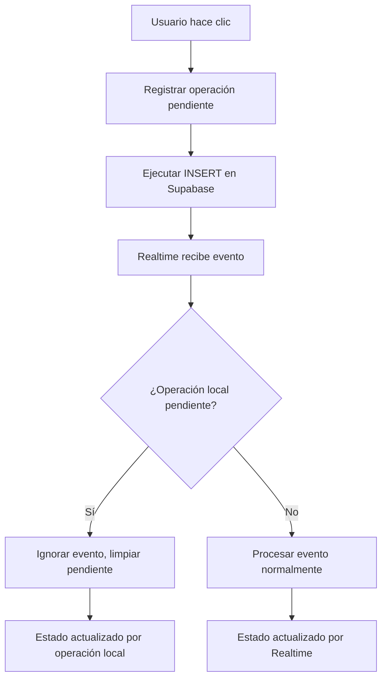
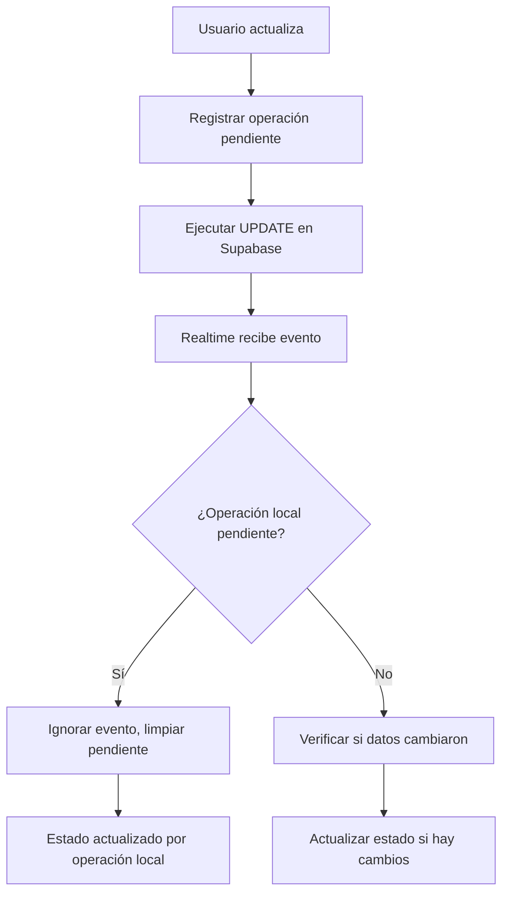
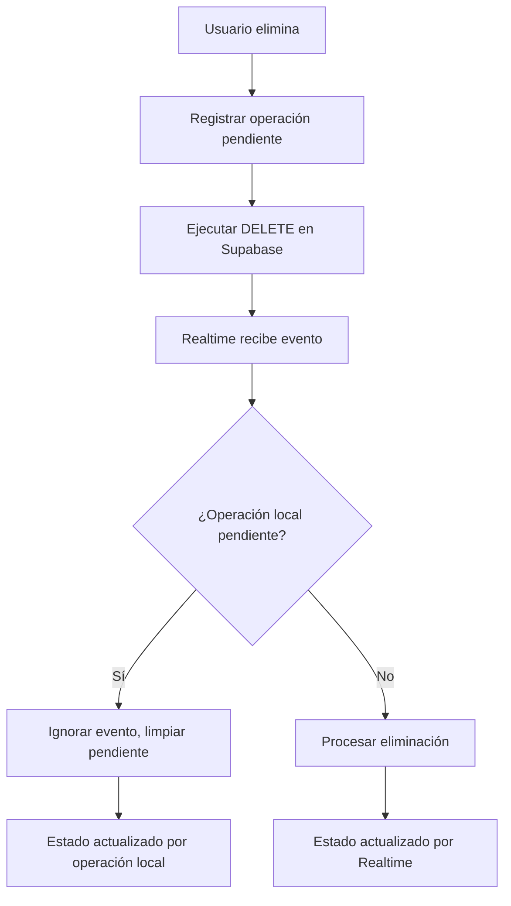

# Sistema de Deduplicación Realtime - Recipunto

## 🎯 **Objetivo**

Implementar un sistema robusto que evite que las suscripciones Realtime interfieran con las operaciones locales, eliminando duplicados y garantizando consistencia de datos.

## 🔍 **Problema Identificado**

### **Antes de la implementación:**
- Las operaciones locales actualizaban el estado
- Realtime recibía el mismo cambio y lo aplicaba nuevamente
- Posibles duplicados o inconsistencias
- Race conditions entre operaciones locales y eventos

### **Después de la implementación:**
- Sistema de deduplicación inteligente
- Operaciones idempotentes por ID
- Control de versiones para detectar cambios reales
- Logging completo para debugging

## 🏗️ **Arquitectura del Sistema**

### **1. Mapa de Operaciones Pendientes**
```typescript
interface PendingOperation {
  id: string
  type: 'INSERT' | 'UPDATE' | 'DELETE'
  timestamp: number
  data?: any
}

const pendingOperations = useRef<Map<string, PendingOperation>>(new Map())
```

**Propósito:**
- Rastrear operaciones iniciadas localmente
- Evitar procesar eventos Realtime duplicados
- Limpiar operaciones expiradas automáticamente

### **2. Sistema de Versionado**
```typescript
const boxVersions = useRef<Map<string, number>>(new Map())

const hasDataChanged = useCallback((boxId: string, newData: any): boolean => {
  const currentVersion = boxVersions.current.get(boxId) || 0
  const newVersion = currentVersion + 1
  boxVersions.current.set(boxId, newVersion)
  return true
}, [])
```

**Propósito:**
- Detectar cambios reales en los datos
- Evitar actualizaciones innecesarias
- Mantener historial de versiones

### **3. Tiempo de Expiración**
```typescript
const OPERATION_EXPIRY = 5000 // 5 segundos

setTimeout(() => {
  pendingOperations.current.delete(key)
}, OPERATION_EXPIRY)
```

**Propósito:**
- Limpiar operaciones huérfanas
- Prevenir acumulación de memoria
- Manejar casos de error

## 🔄 **Flujo de Operaciones**

### **Operación INSERT:**


### **Operación UPDATE:**


### **Operación DELETE:**


## 🛡️ **Mecanismos de Protección**

### **1. Verificación de Operaciones Pendientes**
```typescript
const isOperationPending = useCallback((type: string, id: string): boolean => {
  const key = `${type}_${id}`
  return pendingOperations.current.has(key)
}, [])

// En el evento Realtime:
if (isOperationPending('UPDATE', payload.new.id)) {
  console.log('Ignorando evento UPDATE - operación local en progreso')
  clearPendingOperation('UPDATE', payload.new.id)
  return
}
```

### **2. Limpieza Automática**
```typescript
const clearPendingOperation = useCallback((type: string, id: string) => {
  const key = `${type}_${id}`
  pendingOperations.current.delete(key)
  debug.logEvent(`Operación ${type} completada para ID: ${id}`)
}, [debug])
```

### **3. Manejo de Errores**
```typescript
try {
  // ... operación
} catch (err) {
  // Limpiar operación pendiente en caso de error
  clearPendingOperation('UPDATE', boxId)
  debug.logError(`Error al actualizar caja: ${error.message}`)
  throw err
}
```

## 📊 **Sistema de Logging y Debug**

### **Hook de Debug**
```typescript
export function useRealtimeDebug() {
  const [debugInfo, setDebugInfo] = useState<RealtimeDebugInfo>({
    connectionStatus: 'unknown',
    pendingOperations: [],
    boxVersions: {},
    lastEvent: null,
    eventCount: 0,
    errorCount: 0
  })
  
  // Funciones para logging
  const logEvent = useCallback((event: string) => { /* ... */ }, [])
  const logError = useCallback((error: string) => { /* ... */ }, [])
}
```

### **Panel de Debug Visual**
- Solo visible en modo desarrollo
- Muestra estado de conexión en tiempo real
- Contadores de eventos y errores
- Exportación de logs para análisis

## 🧪 **Casos de Prueba**

### **Caso 1: Operación Local Exitosa**
1. Usuario hace clic para agregar caja
2. Se registra operación pendiente INSERT
3. Se ejecuta INSERT en Supabase
4. Realtime recibe evento INSERT
5. Se detecta operación pendiente
6. Se ignora evento, se limpia pendiente
7. Estado se mantiene consistente

### **Caso 2: Operación Local Fallida**
1. Usuario hace clic para actualizar caja
2. Se registra operación pendiente UPDATE
3. Error en Supabase
4. Se limpia operación pendiente
5. Se registra error en logs
6. Estado no se modifica

### **Caso 3: Cambio Externo**
1. Otro usuario actualiza caja
2. Realtime recibe evento UPDATE
3. No hay operación pendiente local
4. Se procesa evento normalmente
5. Estado se actualiza
6. Se muestra notificación

## 🔧 **Configuración y Uso**

### **Habilitar Debug Mode:**
```typescript
// El panel de debug se muestra automáticamente en desarrollo
// Para producción, se oculta completamente
if (process.env.NODE_ENV !== 'development') {
  return null
}
```

### **Acceder a Información de Debug:**
```typescript
const { 
  getPendingOperations, 
  getBoxVersions, 
  debug 
} = useBoxes()

// Obtener operaciones pendientes
const pendingOps = getPendingOperations()

// Obtener versiones de cajas
const versions = getBoxVersions()

// Acceder a funciones de debug
debug.logEvent('Evento personalizado')
debug.exportDebugLogs()
```

## 📈 **Métricas y Monitoreo**

### **Métricas Disponibles:**
- **Eventos procesados**: Contador de eventos Realtime
- **Errores**: Contador de errores de conexión
- **Operaciones pendientes**: Estado de operaciones en curso
- **Versiones de cajas**: Historial de cambios
- **Estado de conexión**: Estado actual de Realtime

### **Logs Exportables:**
- Timestamp de eventos
- Estado de conexión
- Operaciones pendientes
- Versiones de cajas
- Intentos de reconexión

## 🚀 **Beneficios del Sistema**

### **Para Desarrolladores:**
- **Debugging fácil**: Panel visual en desarrollo
- **Logs detallados**: Trazabilidad completa
- **Exportación de datos**: Análisis offline
- **Simulación de eventos**: Pruebas controladas

### **Para Usuarios:**
- **Consistencia de datos**: Sin duplicados
- **Rendimiento mejorado**: Menos re-renders
- **Experiencia fluida**: Sin parpadeos
- **Sincronización confiable**: Estado siempre actualizado

### **Para la Aplicación:**
- **Escalabilidad**: Manejo eficiente de múltiples usuarios
- **Robustez**: Recuperación automática de errores
- **Mantenibilidad**: Código limpio y documentado
- **Monitoreo**: Visibilidad completa del sistema

## 🔮 **Mejoras Futuras**

### **Optimizaciones Planificadas:**
- **Compresión de datos**: Reducir tamaño de eventos
- **Cache inteligente**: Almacenamiento local para offline
- **Sincronización diferida**: Para conexiones lentas
- **Notificaciones push**: Para navegadores compatibles

### **Funcionalidades Adicionales:**
- **Historial de cambios**: Log de todas las modificaciones
- **Filtros de notificación**: Personalización por usuario
- **Sonidos**: Alertas auditivas
- **Modo offline**: Funcionamiento sin conexión

## 📚 **Recursos Adicionales**

- [Documentación de Supabase Realtime](https://supabase.com/docs/guides/realtime)
- [Guía de configuración](SUPABASE_REALTIME_SETUP.md)
- [README de funcionalidades](README_REALTIME.md)
- [Componentes UI disponibles](../src/components/UI/)
- [Hooks personalizados](../src/hooks/)
